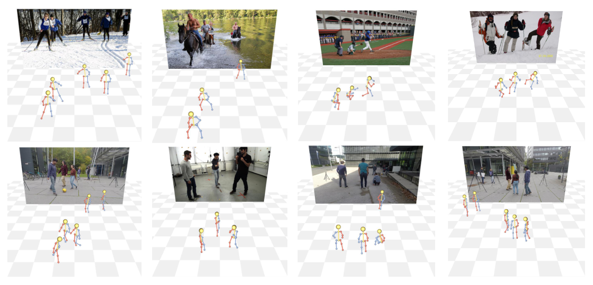
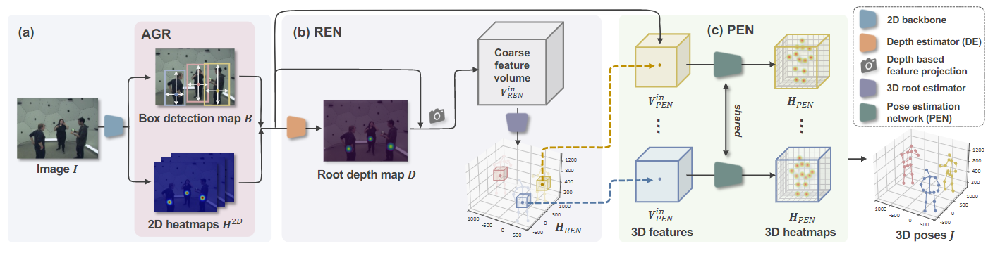

# VirtualPose: Learning Generalizable 3D Human Pose Models from Virtual Data (ECCV 2022)



## Introduction
This is the official [Pytorch](https://pytorch.org/) implementation for:
**VirtualPose: Learning Generalizable 3D Human Pose Models from Virtual Data**


## Installation
```
pip install -r requirement.txt
```

## Data preparation

The directory tree should look like this:
```
${ROOT}
|-- data
    |-- MSCOCO
    |   |-- annotations
    |   |   |-- person_keypoints_train2017.json
    |   |-- images
    |   |   |-- train2017
    |-- MuCo-3DHP
    |   |-- images
    |   |   |-- augmented_set
    |   |   |-- unaugmented_set
    |   |-- MuCo-3DHP.json
    |-- MuPoTS-3D
    |   |-- cameras.pkl
    |   |-- images
    |   |   |-- TS1
    |   |   |-- ...
    |   |   |-- TS20
    |   |-- MuPoTS-3D.json
    |-- panoptic-toolbox
    |   |-- data
    |   |-- data_hmor
    |   |   |-- 160224_haggling1
    |   |   |-- 160224_mafia1
    |   |   |-- ...
    |   |   |-- train_cam.pkl
    |   |   |-- val_cam.pkl
    |   |-- clean_train.pkl 
    |   |-- clean_valid.pkl 
    |   |-- pack.py
|-- models
    |-- pose_resnet_152_384x288.pth.tar
```

* Download MSCOCO parsed data [[data](https://cocodataset.org/#download)]
* Download MuCo parsed and composited data [[data](https://drive.google.com/drive/folders/1yL2ey3aWHJnh8f_nhWP--IyC9krAPsQN?usp=sharing)] provided by [[RootNet](https://github.com/mks0601/3DMPPE_ROOTNET_RELEASE)]
* Download MuPoTS parsed data [[images](http://gvv.mpi-inf.mpg.de/projects/SingleShotMultiPerson/)][[annotations](https://drive.google.com/drive/folders/1WmfQ8UEj6nuamMfAdkxmrNcsQTrTfKK_?usp=sharing)]

* Download Panoptic by following the instructions in [panoptic-toolbox](https://github.com/CMU-Perceptual-Computing-Lab/panoptic-toolbox) and extract them under `${ROOT}/data/panoptic-toolbox/data`. Download[[annotations](https://drive.google.com/drive/folders/1TMQmbNWmqNDN-skCqF7B8LpLIkr_bqc1)] provided by [[HMOR](https://arxiv.org/abs/2008.00206)] and put them under  `${ROOT}/data/panoptic-toolbox/$`, and run `python pack.py`.

* Download pretrained ResNet-152 model [pose_resnet_152_384x288.pth.tar](https://drive.google.com/drive/folders/1fGLeCgTbaO50wylfV_j1OFTEx8DDpaqh) provided by [[Simple Baselines](https://github.com/microsoft/human-pose-estimation.pytorch)] and put it under `${ROOT}/models/$`.


## Training
We use 4 NVIDIA V100 with 32GB GPU memory for training.

### CMU Panoptic dataset

Train the 2D pose estimation and human detection backbone with 2 gpus:
```
python run/train_3d.py --cfg configs/coco/backbone_res152_mix_panoptic.yaml --gpus 2
```
Train the root depth estimator and 3D pose estimator with 4 gpus:
```
python run/train_3d.py --cfg configs/panoptic/synthesize_full.yaml --gpus 4
```

### MuCo-3DHP and MuPoTS-3D datasets

Train the 2D pose estimation and human detection backbone with 2 gpus:
```
python run/train_3d.py --cfg configs/coco/backbone_res152_mix_muco.yaml --gpus 2
```
Train the root depth estimator and 3D pose estimator with 4 gpus:
```
python run/train_3d.py --cfg configs/muco/synthesize_full.yaml --gpus 4
```

## Evaluation
### CMU Panoptic dataset

Inference with 4 gpus:
```
python run/validate_3d.py --cfg configs/panoptic/synthesize_full_inference.yaml --gpus 4
```

### MuCo-3DHP and MuPoTS-3D datasets

Inference with 4 gpus:
```
python run/validate_3d.py --cfg configs/muco/synthesize_full_inference.yaml --gpus 4
```

The results are in `${ROOT}/mupots_results/$`, then use the evaluation code provided by MuPoTS-3D dataset to evaluate the results.

# Acknowledgement
This repo is built on https://github.com/microsoft/voxelpose-pytorch. 

